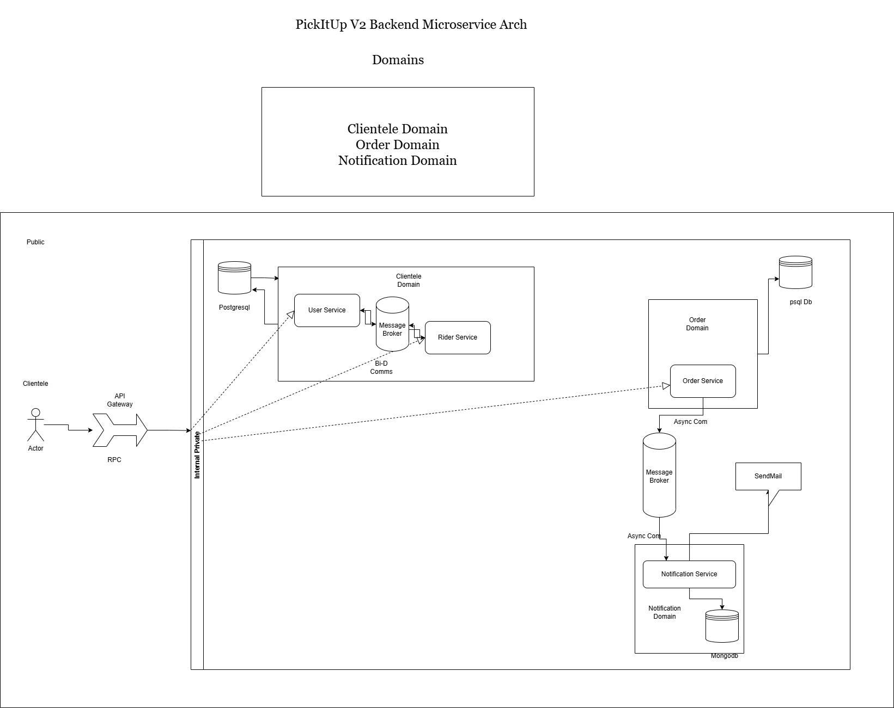

# PickItUp V2 🚀

**PickItUp V2** is a scalable, microservices-based logistics and delivery platform built with **Go**. It leverages a modern event-driven architecture to handle users, riders, orders, and real-time notifications efficiently.



## 🏗 Architecture

The system follows a **Microservices Architecture** with a **Gateway Pattern**:

*   **API Gateway**: The entry point for all external client requests (HTTP/JSON). It handles routing, authentication, and balances load across services using **Consul** for service discovery.
*   **gRPC Microservices**: Internal services communicate via high-performance **gRPC**.
*   **Event-Driven**: Asynchronous tasks (like emails and notifications) are decoupled using **RabbitMQ**.

## 🛠 Tech Stack

*   **Language**: [Go (Golang)](https://go.dev/) (1.22+)
*   **Communication**:
    *   **External**: HTTP/REST (Gorilla Mux)
    *   **Internal**: gRPC (Protobuf)
*   **Service Discovery**: [Consul](https://www.consul.io/)
*   **Message Broker**: [RabbitMQ](https://www.rabbitmq.com/)
*   **Caching & KV**: [Redis](https://redis.io/)
*   **Database**: PostgreSQL (with GORM)
*   **Authentication**: JWT (JSON Web Tokens)

## 📦 Services

| Service | Description | Port |
| :--- | :--- | :--- |
| **Gateway** | HTTP Entry point, Auth middleware, Routing | `:2330` |
| **Users** | User management, Auth, Wallet, OTP | gRPC |
| **Orders** | Order creation, tracking, history | gRPC |
| **Riders** | Rider management, location updates | gRPC |
| **Notifications** | Email/Push notifications (consumes RabbitMQ) | - |

## 🚀 Getting Started

### Prerequisites

*   Go 1.22+
*   Docker (Optional, for infra)
*   PostgreSQL
*   Redis
*   RabbitMQ
*   Consul (Must be running for service discovery)

### Installation

1.  **Clone the repository**
    ```bash
    git clone https://github.com/Ayobami6/pickitup_v2.git
    cd pickitup_v2
    ```

2.  **Start Infrastructure**
    Ensure Postgres, Redis, RabbitMQ, and Consul are running.

3.  **Run Services**
    You can run each service independently. It's recommended to start them in this order:

    ```bash
    # 1. Start Users Service
    cd users && go run main.go

    # 2. Start Riders Service
    cd riders && go run main.go

    # 3. Start Orders Service
    cd orders && go run main.go

    # 4. Start Gateway
    cd gateway && go run main.go
    ```

## 📝 API Endpoints

### Auth & Users
*   `POST /api/v2/register` - Register a new user
*   `POST /api/v2/login` - Login and receive JWT
*   `GET /api/v2/users/details` - Get profile (Auth required)
*   `POST /api/v2/users/otp/verify` - Verify Email OTP

---
*Built with ❤️ by Ayobami*